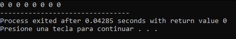

# Calloc Memory Allocation

A simple C program demonstrating dynamic memory allocation and automatic initialization using `calloc()`.

## Overview

This project illustrates the use of the `calloc()` function to allocate memory dynamically for an integer array.

Unlike `malloc()`, `calloc()` initializes the allocated memory to zero, making it useful when predictable initial values are required.

The program serves as an educational example for understanding dynamic memory allocation and pointer usage in C.

## Features

- Dynamic memory allocation using `calloc()`.
- Automatic memory initialization.
- Integer array allocation.
- Console-based demonstration.

## Screenshot



## Technologies

- C
- Standard C Library
- Dev-C++

## Project Structure

```text
.
├── assets
│   └── images
│       └── calloc_memory_allocation_demo.jpg
├── calloc_memory_allocation.cpp
├── README.md
├── LICENSE
└── .gitignore
```

## How to Compile

Using GCC:

```bash
g++ calloc_memory_allocation.cpp -o calloc_memory_allocation
```

## How to Run

Windows

```bash
calloc_memory_allocation.exe
```

Linux/macOS

```bash
./calloc_memory_allocation
```

## Concepts Demonstrated

- Dynamic memory allocation
- `calloc()`
- Pointer manipulation
- Memory initialization
- Arrays in C

## Future Improvements

- Allow the user to specify the array size.
- Display all allocated elements correctly.
- Compare `calloc()` with `malloc()`.
- Release allocated memory using `free()`.

## License

This project is licensed under the MIT License.

## Author

Luis Alva
